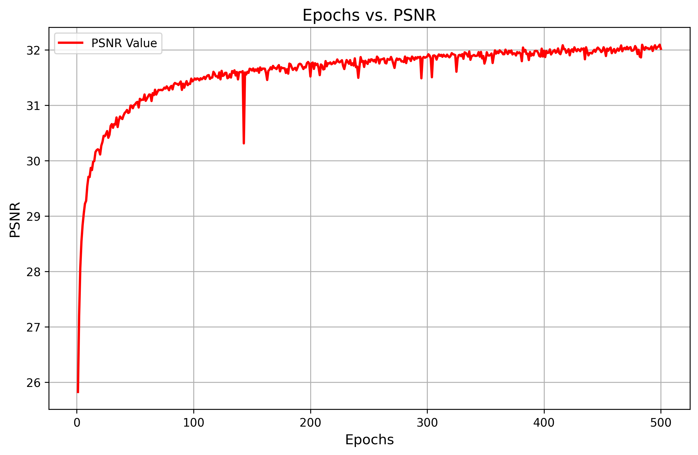
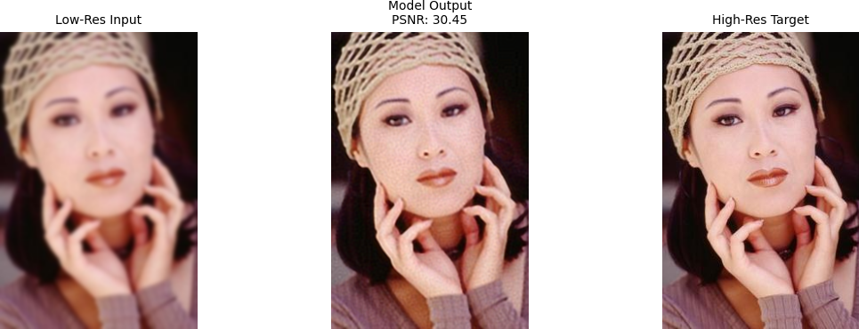

# SRCNN

This repository contains my reimplementation of the [Image Super-Resolution Using Deep Convolutional Neural Networks (SRCNN)](https://arxiv.org/abs/1501.00092) paper. The project aims to recreate the results of the original paper and explore the performance of the SRCNN model on super-resolution tasks.

## Datasets Used
- **T91**: Used for training.
- **Set14**: Used for evaluation.
- **Set5**: Used for testing.

## Achieved Performance
The highest PSNR (Peak Signal-to-Noise Ratio) value achieved on the Set5 dataset is **32.02 dB**.

## PSNR Values Over Epochs
The following graph illustrates the PSNR values achieved during training:

### Sample Results

## Results Comparison
### Low-Resolution vs. SRCNN (High-Resolution) Output
| **Low Resolution**            | **SRCNN High Resolution**      | 
|--------------------------------|--------------------------------|
|  |  |
